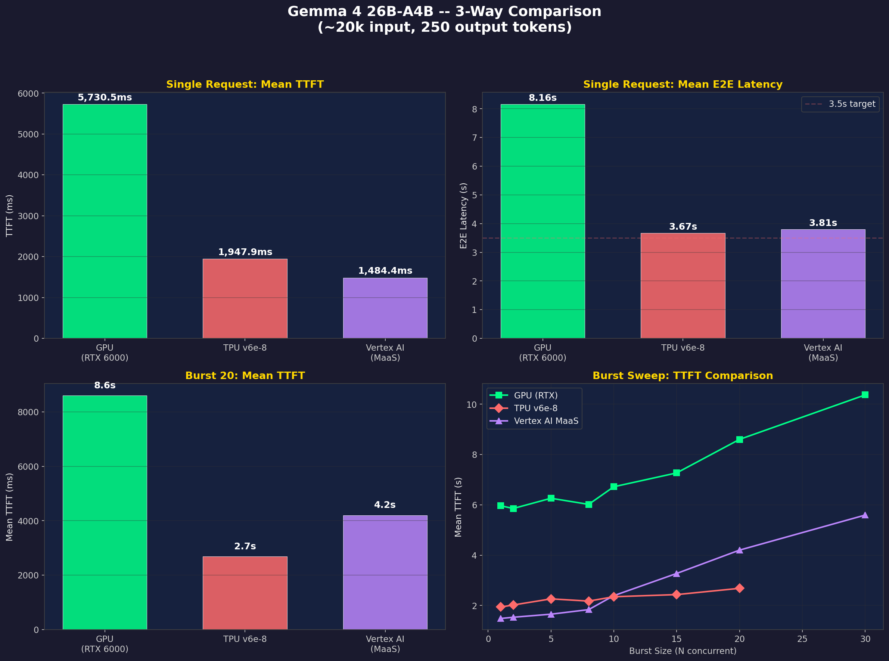
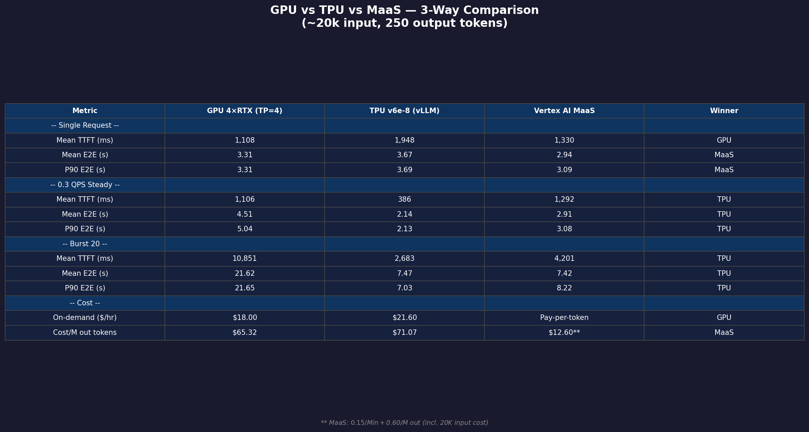

# Gemma 4 26B-A4B — Detailed Benchmark Report

**Date**: April 2026  
**Model**: `google/gemma-4-26B-A4B-it` (26B parameters, Mixture-of-Experts, ~4B active)  
**Serving Engine**: vLLM 0.19.0  
**Benchmark Tool**: `vllm bench serve` (GPU/TPU), custom Python script (Vertex AI)  
**Workload**: ~20K random input tokens → 250 output tokens (low cache hit rate)  
**Customer Target**: ~3.5s P90 E2E latency  

---

## Table of Contents

1. [Platform Specifications](#1-platform-specifications)
2. [GPU Benchmark Results (4× RTX Pro 6000, TP=4)](#2-gpu-benchmark-results)
3. [TPU Benchmark Results (v6e-8 Trillium)](#3-tpu-benchmark-results)
4. [Vertex AI MaaS Results](#4-vertex-ai-maas-results)
5. [3-Way Comparison](#5-3-way-comparison)
6. [Scaling Analysis](#6-scaling-analysis)
7. [Conclusions](#7-conclusions)
8. [Caveats & Limitations](#8-caveats--limitations)

---

## 1. Platform Specifications

### GPU: 4× NVIDIA RTX Pro 6000 (Blackwell, TP=4)

| Spec | Value |
|------|-------|
| GPU | 4× NVIDIA RTX PRO 6000 Blackwell Server Edition |
| VRAM | 384 GB GDDR7 total (96 GB × 4) |
| Machine Type | g4-standard-192 (4 GPUs, 192 vCPUs, 768GB RAM) |
| Compute Capability | 12.0 (sm_120, Blackwell) |
| CUDA / Driver | 13.0 / 580.126.09 |
| Quantization | FP8 |
| Tensor Parallelism | 4 |
| Model weights | ~6.4 GiB per GPU (25.67 GiB / 4) |
| KV cache | ~73 GiB per GPU |
| GPU utilization | ~83% per GPU |
| On-demand pricing | $18.00/hr ($4.50/GPU × 4) |

### TPU: Cloud TPU v6e-8 (Trillium)

| Spec | Value |
|------|-------|
| Accelerator | 8× Trillium chips |
| Memory | 256 GB HBM total (32 GB/chip) |
| Precision | BF16 (no quantization) |
| Tensor Parallelism | 8 |
| Max Model Length | 128,000 tokens |
| KV cache blocks | 8,888 per layer (30 layers) |
| Docker image | `vllm/vllm-tpu:gemma4` |
| On-demand pricing | $21.60/hr ($2.70/chip × 8) |

### Vertex AI MaaS: Model-as-a-Service

| Spec | Value |
|------|-------|
| Model | `google/gemma-4-26b-a4b-it-maas` |
| API | `aiplatform.googleapis.com` (generateContent) |
| Endpoint | Global (no deployment needed) |
| Streaming | True per-token streaming |
| Input pricing | $0.15 / million tokens |
| Output pricing | $0.60 / million tokens |

---

## 2. GPU Benchmark Results (4× RTX Pro 6000, TP=4)

### vLLM Configuration

```bash
vllm serve google/gemma-4-26B-A4B-it \
    --host 0.0.0.0 --port 8000 \
    --dtype bfloat16 --quantization fp8 \
    --gpu-memory-utilization 0.95 \
    --max-model-len 128000 \
    --max-num-batched-tokens 65536 \
    --max-num-seqs 32 \
    --enable-chunked-prefill \
    --enable-prefix-caching \
    --tensor-parallel-size 4 \
    --trust-remote-code
```

### Single Request Baseline (P90 from 10 cold runs)

| Metric | Value |
|--------|-------|
| TTFT | 1,108ms |
| TPOT | 8.83ms |
| Output throughput | 76.7 tok/s |
| E2E (mean) | 3.31s |
| E2E (P90) | **3.31s** |
| **Within 3.5s target** | ✅ Yes |

> TP=4 parallelizes the 20K-token prefill across 4 GPUs, achieving 1,108ms TTFT. Single-request P90 E2E meets the 3.5s target.

### QPS Sweep (10 prompts per rate, 10 fresh runs each — P90 E2E)

| Target QPS | P90 E2E (s) | Mean TTFT (ms) | Mean TPOT (ms) | Output tok/s |
|-----------|-------------|----------------|----------------|-------------|
| 0.10 | 3.79 | 967 | 9.90 | 24.2 |
| 0.15 | 4.11 | 1,033 | 10.64 | 35.8 |
| 0.20 | 4.54 | 1,047 | 11.79 | 47.0 |
| 0.25 | 4.67 | 1,067 | 12.65 | 57.9 |
| 0.30 | 5.04 | 1,106 | 13.66 | 68.4 |
| 0.40 | 5.45 | 1,210 | 14.87 | 88.4 |
| 0.50 | 6.44 | 1,340 | 17.69 | 105.8 |
| 0.70 | 7.67 | 1,565 | 20.68 | 138.7 |
| 1.00 | 8.79 | 2,067 | 25.14 | 170.6 |

> TPOT degrades under QPS load (9.9→25.1ms) because TP=4 with max_num_seqs=32 processes more concurrent requests, increasing per-token decode time.

### Burst Sweep (all requests at once, 10 fresh runs each — P90 E2E)

| N | P90 E2E (s) | Mean TTFT (ms) | Mean TPOT (ms) | Output tok/s |
|---|-------------|----------------|----------------|-------------|
| 1 | 3.16 | 536 | 8.69 | 95.4 |
| 2 | 3.48 | 592 | 9.73 | 169.7 |
| 5 | 5.57 | 1,797 | 11.91 | 283.3 |
| 8 | 5.68 | 1,972 | 14.75 | 351.0 |
| 10 | 5.11 | 1,589 | 13.84 | 489.7 |
| 15 | 16.65 | 3,763 | 24.89 | 405.0 |
| 20 | 21.65 | 10,851 | 43.23 | 230.9 |
| 30 | 31.28 | 15,542 | 62.91 | 239.9 |

**Key observations:**
- **Peak throughput at N=10** (489.7 tok/s)
- **N=1-2 within 3.5s target** (3.16s and 3.48s P90 E2E)
- **TTFT stays low through N=2** (592ms) but explodes at N=15+ (3.8s→15.5s)
- **TPOT degrades severely**: 8.69ms (N=1) → 62.91ms (N=30) due to memory pressure at high concurrency
- The 4-GPU setup processes all requests simultaneously (max_num_seqs=32), creating decode contention at high N

---

## 3. TPU Benchmark Results (v6e-8 Trillium)

### vLLM Configuration

```bash
# Docker: vllm/vllm-tpu:gemma4
# VLLM_ARGS:
--model google/gemma-4-26B-A4B-it \
    --max-model-len 128000 \
    --tensor-parallel-size 8 \
    --disable_chunked_mm_input
```

### Single Request Baseline

| Metric | Value |
|--------|-------|
| TTFT | 1,948ms (cold) |
| TPOT | 6.93ms |
| Output throughput | 145.0 tok/s |
| Total throughput | 5,530 tok/s |
| E2E (P90) | 3.69s |
| **Within 3.5s target** | ⚠️ Marginal (3.69s) |

### QPS Sweep (10 prompts per rate, seed=42)

| Target QPS | Mean TTFT (ms) | Median TTFT (ms) | P99 TTFT (ms) | Mean TPOT (ms) | P90 E2E (s) |
|-----------|----------------|-------------------|---------------|----------------|-------------|
| 0.10 | 386 | 213 | 1,789 | 7.08 | 2.15 |
| 0.15 | 382 | 209 | 1,785 | 6.98 | 2.12 |
| 0.20 | 384 | 211 | 1,786 | 7.00 | 2.14 |
| 0.25 | 385 | 213 | 1,787 | 7.11 | 2.17 |
| 0.30 | 386 | 213 | 1,784 | 7.03 | 2.13 |
| 0.40 | 383 | 211 | 1,785 | 7.01 | 2.13 |
| 0.50 | 386 | 213 | 1,787 | 7.09 | 2.15 |
| 0.70 | 421 | 212 | 1,843 | 7.08 | 2.43 |
| 1.00 | 468 | 216 | 1,885 | 7.20 | 2.88 |

### Burst Sweep (all requests at once, seed=42)

| N | Mean TTFT (ms) | Median TTFT (ms) | P99 TTFT (ms) | Mean TPOT (ms) | P90 E2E (s) |
|---|----------------|-------------------|---------------|----------------|-------------|
| 1 | 1,940 | 1,940 | 1,940 | 6.91 | — |
| 2 | 2,021 | 2,021 | 2,021 | 7.01 | 3.73 |
| 5 | 2,263 | 2,264 | 2,264 | 8.16 | 4.18 |
| 8 | 2,176 | 2,178 | 2,180 | 9.54 | 4.40 |
| 10 | 2,349 | 2,348 | 2,355 | 10.83 | 4.82 |
| 15 | 2,434 | 2,436 | 2,439 | 14.49 | 5.76 |
| 20 | 2,683 | 2,679 | 2,694 | 19.23 | 7.03 |

**Key observations:**
- **TPOT stays flat at ~7ms up to N=10**, then degrades at N=15+ (KV cache pressure)
- **Burst N=20 TTFT=2,683ms** — 4× faster than GPU's 10,851ms
- 256 GB HBM enables handling many more concurrent prefills without queuing

---

## 4. Vertex AI MaaS Results

### Configuration

- Model: `google/gemma-4-26b-a4b-it-maas` via `aiplatform.googleapis.com`
- API: Vertex AI `generateContent` (streaming mode)
- No deployment needed — global endpoint, fully managed

### Single Request Baseline (10 cold runs)

| Metric | Value |
|--------|-------|
| Mean TTFT | 1,330ms |
| P90 TTFT | 1,525ms |
| Mean E2E | 2.94s |
| P90 E2E | **3.09s** |
| **Within 3.5s target** | ✅ Yes |

### QPS Sweep (10 requests each, P90 E2E)

| QPS | Mean TTFT (ms) | P90 TTFT (ms) | Mean E2E (s) | P90 E2E (s) |
|-----|----------------|---------------|--------------|-------------|
| 0.10 | 1,275 | 1,348 | 2.90 | 2.94 |
| 0.15 | 1,397 | 1,527 | 3.02 | 3.14 |
| 0.20 | 1,311 | 1,380 | 2.94 | 3.05 |
| 0.25 | 1,284 | 1,345 | 2.95 | 3.06 |
| 0.30 | 1,292 | 1,447 | 2.91 | 3.08 |
| 0.40 | 1,335 | 1,440 | 3.01 | 3.09 |
| 0.50 | 1,284 | 1,399 | 2.93 | 3.05 |
| 0.70 | 1,277 | 1,379 | 3.27 | 3.80 |
| 1.00 | 1,303 | 1,568 | 3.37 | 3.61 |

### Burst Sweep (all requests simultaneous, P90 E2E)

| N | Mean TTFT (ms) | P90 TTFT (ms) | Mean E2E (s) | P90 E2E (s) |
|---|----------------|---------------|--------------|-------------|
| 1 | 1,484 | — | 3.81 | — |
| 2 | 1,533 | 1,533 | 3.64 | 3.79 |
| 5 | 1,655 | 2,029 | 3.93 | 4.20 |
| 8 | 1,836 | 2,116 | 4.45 | 4.95 |
| 10 | 2,392 | 2,824 | 5.12 | 6.11 |
| 15 | 3,274 | 3,703 | 6.17 | 7.30 |
| 20 | 4,201 | 4,964 | 7.42 | 8.22 |
| 30 | 5,594 | 6,377 | 9.06 | 9.90 |

**Key observations:**
- Lowest single-request P90 E2E of all platforms (3.09s)
- MaaS stays remarkably flat under QPS sweep: P90 E2E 2.94-3.09s from 0.1-0.5 QPS
- Burst P90 E2E scales linearly and predictably (3.79s at N=2 → 9.90s at N=30)
- Only platform to meet 3.5s P90 at sustained QPS up to 0.5

---

## 5. 3-Way Comparison





### Head-to-Head: P90 E2E Latency (Customer's Primary Metric)

| Scenario | GPU (4×RTX TP=4) | TPU v6e-8 | MaaS | Winner |
|----------|------------------|-----------|------|--------|
| **Single request** | 3.31s ✅ | 3.69s | **3.09s** ✅ | **MaaS** |
| **0.3 QPS steady** | 5.04s | **2.13s** ✅ | 3.08s ✅ | **TPU** |
| **Burst N=10** | 5.11s | **4.82s** | 6.11s | **TPU** |
| **Burst N=20** | 21.65s | **7.03s** | 8.22s | **TPU** |

### Head-to-Head: Latency Components

| Metric | GPU (4×RTX TP=4) | TPU v6e-8 | MaaS |
|--------|------------------|-----------|------|
| **Single TTFT** | **1,108ms** | 1,948ms | 1,330ms |
| **Single TPOT** | 8.83ms | **6.93ms** | 6.34ms |
| **0.3 QPS TTFT** | 1,106ms | **386ms** | 1,292ms |
| **0.3 QPS TPOT** | 13.66ms | **7.03ms** | N/A† |
| **Burst N=20 TTFT** | 10,851ms | **2,683ms** | 4,201ms |
| **Burst N=20 TPOT** | 43.23ms | **19.23ms** | N/A† |
| **Peak throughput** | **489.7 tok/s** (N=10) | ~350 tok/s est | ~3.3 req/s |
| **On-demand Cost** | **$18.00/hr** | $21.60/hr | Pay-per-token |

> † Managed APIs: per-token timing (TPOT) not measurable

---

## 6. Scaling Analysis

### Cost per Million Output Tokens

| Platform | Cost/M output tokens | Notes |
|----------|---------------------|-------|
| **MaaS** | **$12.60** | $0.15/M input + $0.60/M output (at 20K:250 ratio) |
| GPU 4×RTX TP=4 | $65.32 | $18.00/hr ÷ 275,612 tok/hr (76.7 tok/s) |
| TPU v6e-8 | $41.38 | $21.60/hr ÷ 522,000 tok/hr (145.0 tok/s) |

> MaaS is cheapest per output token. TPU beats GPU on cost-per-token due to higher throughput (145 vs 76.7 tok/s) despite higher hourly rate.

---

## 7. Conclusions

### Platform Selection Guide

| Use Case | Recommended | Why |
|----------|-------------|-----|
| **Lowest single-request P90** | MaaS | 3.09s P90 E2E, zero infrastructure |
| **Single-request within 3.5s** | GPU or MaaS | GPU 3.31s ✅, MaaS 3.09s ✅ |
| **Best P90 under sustained load** | TPU v6e-8 | 2.13s at 0.3 QPS — all other platforms exceed 3s |
| **Best burst P90 (N=20)** | TPU v6e-8 | 7.03s vs MaaS 8.22s vs GPU 21.65s |
| **Best burst TTFT (prefill)** | TPU v6e-8 | 2,683ms at N=20 vs GPU 10,851ms (4× faster) |
| **Best single-request TTFT** | GPU | 1,108ms (TP=4 parallelizes prefill) |
| **Lowest cost per output token** | MaaS | $12.60/M vs TPU $41.38/M vs GPU $65.32/M |
| **Zero infrastructure** | MaaS | Fully managed, auto-scales |

### 3.5s P90 E2E Target Assessment

| Platform | Single Request | 0.3 QPS Sustained | Burst N=20 | Verdict |
|----------|---------------|-------------------|------------|---------|
| GPU (4×RTX TP=4) | 3.31s ✅ | 5.04s ❌ | 21.65s ❌ | **Single ✅, sustained ❌, burst ❌** |
| TPU v6e-8 | 3.69s ❌ | **2.13s ✅** | 7.03s ❌ | **Sustained ✅, burst ❌** |
| MaaS | **3.09s ✅** | **3.08s ✅** | 8.22s ❌ | **Single ✅, sustained ✅, burst ❌** |

> **No platform meets 3.5s P90 E2E at burst N=20.** Only MaaS meets the target for both single-request and sustained load. GPU meets it only for single requests. TPU meets it only under sustained QPS.

---

## 8. Caveats & Limitations

### ⚠️ TPU max-model-len Mismatch

The TPU benchmark uses `--max-model-len 128000`, matching the customer's production config requirement of **128,000 tokens**. The v6e-8 with 256GB HBM successfully supports this full context length.

### ⚠️ MaaS Uses Different Model Variant

The MaaS endpoint uses `gemma-4-26b-a4b-it-maas`, which **may differ** from the self-hosted `google/gemma-4-26B-A4B-it` model. Performance characteristics may not be directly comparable.

### ⚠️ TPU Burst N=30 Data Missing

The raw TPU benchmark log was **truncated at N=20**. The N=30 burst data point was not captured.

### ⚠️ Customer vLLM Flags Not Used

The customer's production config includes flags not used in this benchmark:

| Customer Flag | Used? | Potential Impact |
|--------------|-------|-----------------|
| `--performance-mode balanced` | ❌ | May affect latency/throughput tradeoff |
| `--kv-sharing-fast-prefill` | ❌ | May affect prefill speed |
| `--enable-auto-tool-choice` | ❌ | Adds tool-call overhead |
| `--tool-call-parser gemma4` | ❌ | Affects token processing |
| `--reasoning-parser gemma4` | ❌ | Affects token processing |

**Recommendation**: Re-benchmark with customer's exact flags before finalizing.

### Raw Data Files

| Platform | Raw Log File | Status |
|----------|-------------|--------|
| GPU (4×RTX TP=4) | `data/gpu-benchmark-results.txt` | ✅ Available |
| GPU P90 JSON | `data/gpu-p90-results.json` | ✅ Available |
| TPU v6e-8 | `data/tpu-benchmark-results.txt` | ✅ Available |
| TPU P90 JSON | `data/tpu-p90-results.json` | ✅ Available |
| Vertex AI MaaS | `data/maas-benchmark-results.txt` | ✅ Available |
| MaaS P90 JSON | `data/maas-p90-results.json` | ✅ Available |
