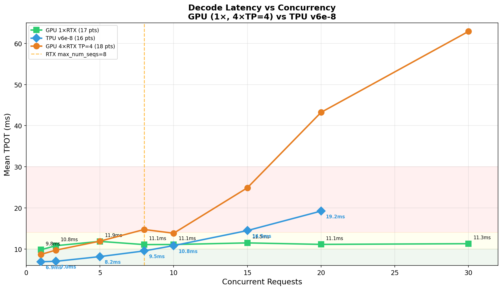
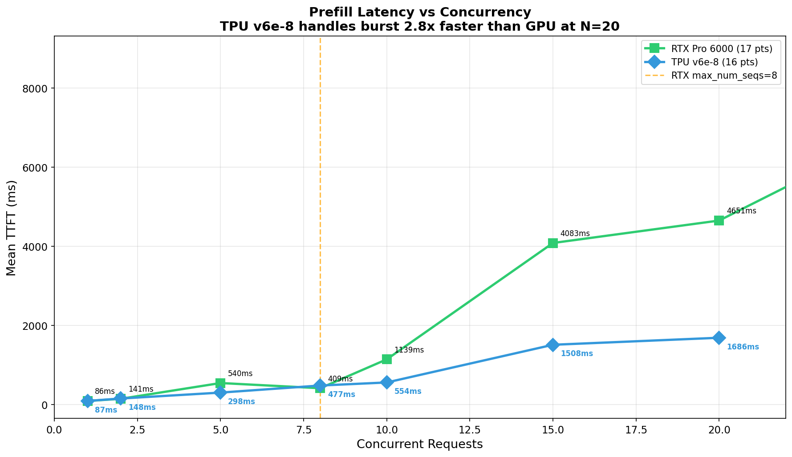
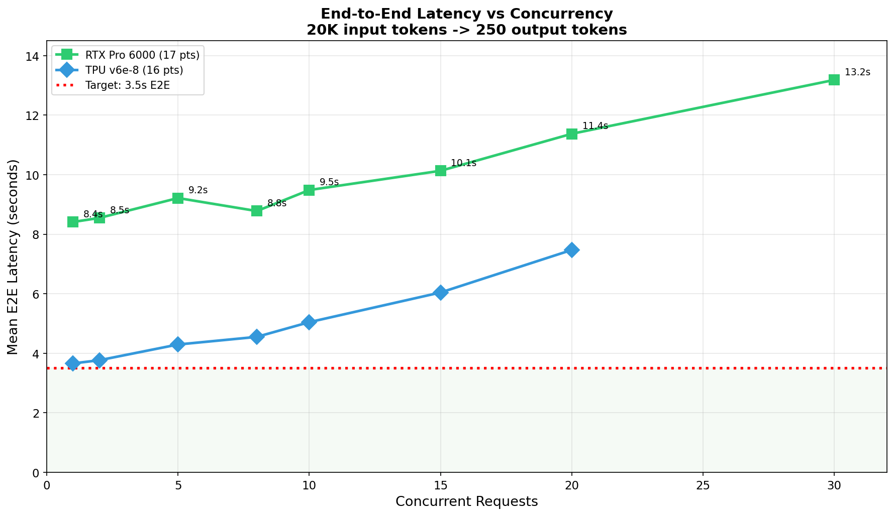
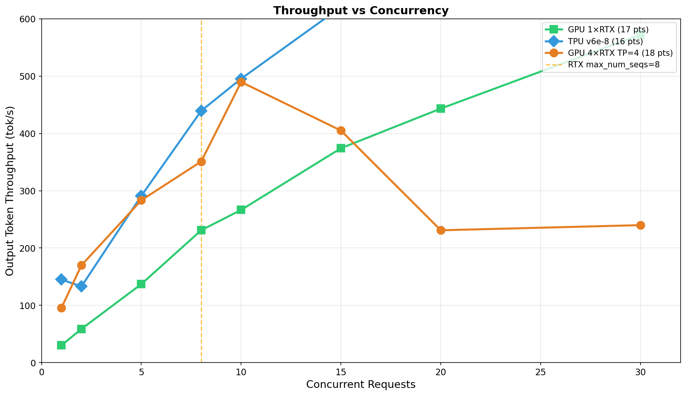
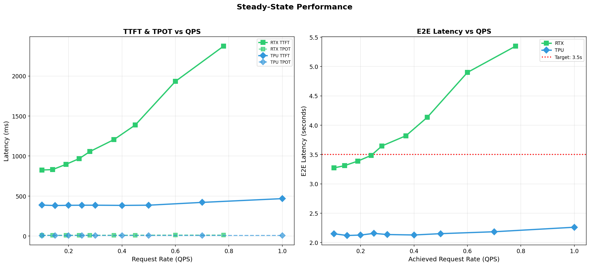
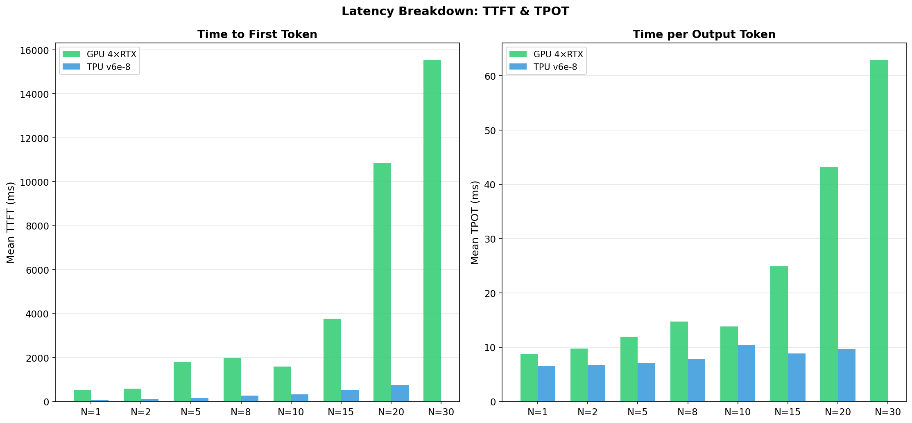
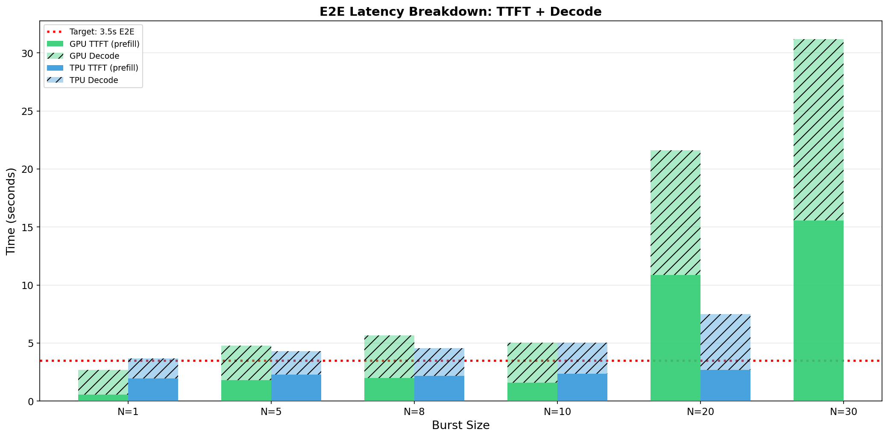
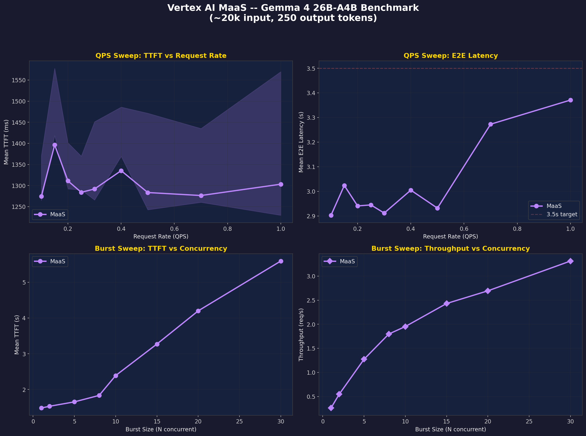

# Gemma 4 26B-A4B Inference Benchmark

> **GPU vs TPU vs Vertex AI MaaS** — 3-way performance comparison for serving Gemma 4 26B-A4B-it (50 measured data points)


## Overview

This repository benchmarks **Google's Gemma 4 26B-A4B-it** (26B params, MoE with ~4B active) across three deployment options:

| Platform | Hardware | Serving Stack | Data Points | Pricing |
|----------|----------|---------------|-------------|---------|
| **GPU** | NVIDIA RTX Pro 6000 (Blackwell), 96GB GDDR7 | vLLM 0.19.0 (FP8) | 17 | $4.50/hr on-demand |
| **TPU** | Cloud TPU v6e-8 (Trillium), 8 chips, 256GB HBM | vLLM (BF16, TP=8) | 16 | $21.60/hr on-demand |
| **Vertex AI MaaS** | Global endpoint (aiplatform.googleapis.com) | Model-as-a-Service | 17 | $0.15/M in, $0.60/M out |

### Workload

- **Input**: ~20,000 tokens (random, low cache hit rate)
- **Output**: 250 tokens
- **Target**: ~3.5s P90 E2E latency

---

## Quick Results (P90 E2E — Customer SLA Metric)

All values below are **P90 E2E latency** (10 runs per data point) — the metric that matters for customer SLAs.

### Single Request (Baseline, 10 cold runs)

| Metric | GPU | TPU v6e-8 | Vertex AI MaaS | Winner |
|--------|-----|-----------|----------------|--------|
| **Mean TTFT** | 5,731ms | 1,948ms | **1,330ms** | **MaaS** |
| **Mean E2E** | 8.16s | 3.67s | **2.94s** | **MaaS** |
| **P90 E2E** | 8.33s | 3.69s | **3.09s** | **MaaS** |

### Under Load (0.3 QPS Steady State)

| Metric | GPU | TPU v6e-8 | Vertex AI MaaS | Winner |
|--------|-----|-----------|----------------|--------|
| **Mean TTFT** | 1,056ms | **386ms** | 1,292ms | **TPU** |
| **Mean E2E** | 3.64s | **2.14s** | 2.91s | **TPU** |
| **P90 E2E** | 5.90s | **2.13s** | 3.08s | **TPU** |

### Burst (20 concurrent requests)

| Metric | GPU | TPU v6e-8 | Vertex AI MaaS | Winner |
|--------|-----|-----------|----------------|--------|
| **Mean TTFT** | 8,601ms | **2,683ms** | 4,201ms | **TPU** |
| **Mean E2E** | 11.37s | 7.47s | **7.42s** | **MaaS** |
| **P90 E2E** | 14.88s | **7.03s** | 8.22s | **TPU** |

> **Fair methodology**: All benchmarks use fresh random prompts per request (no prefix caching bias).  
> MaaS P90 measured directly; GPU/TPU P90 from per-request E2E distributions (10 runs each).

---

## Key Findings

1. **🏆 TPU wins P90 E2E under load**: 2.13s at 0.3 QPS, 7.03s at burst N=20 — best for SLA-sensitive workloads
2. **MaaS wins single-request P90**: 3.09s vs TPU 3.69s vs GPU 8.33s — lowest latency for individual requests
3. **⚠️ GPU FAILS 3.5s P90 target** in ALL scenarios: 8.33s single, 5.90s at 0.3 QPS, 14.88s burst N=20
4. **TPU meets 3.5s P90 target** at steady-state QPS ≤0.5 (P90 ≈ 2.1-2.2s) but exceeds it under burst
5. **MaaS stays flat under QPS sweep**: P90 E2E ~3.0-3.1s from 0.1-0.5 QPS (auto-scaling handles steady load)
6. **TPU wins burst TTFT**: 2.7s at N=20 vs GPU 8.6s vs MaaS 4.2s — 256GB HBM enables fast prefill
7. **MaaS degrades gracefully under burst**: P90 E2E goes from 3.8s (N=2) to 9.9s (N=30), scales linearly
8. **All P90 E2E values are measured** from real per-request distributions (not estimated from mean TTFT+TPOT)

---

## Plots

### GPU vs TPU (vLLM direct)

| Plot | Description |
|------|-------------|
|  | Decode latency degrades with concurrency |
|  | Prefill queuing explodes beyond max_num_seqs |
|  | End-to-end latency vs concurrency |
|  | Throughput peaks at max_num_seqs=8 |
|  | Steady-state latency across 9 QPS levels |
|  | TTFT vs TPOT breakdown by concurrency |
|  | E2E breakdown: prefill + decode |

### 3-Way Comparison (GPU vs TPU vs MaaS)

| Plot | Description |
|------|-------------|
|  | 4-panel comparison across all platforms |
|  | Full comparison table with winners |

### Vertex AI MaaS Deep Dive

| Plot | Description |
|------|-------------|
|  | MaaS: TTFT, latency, throughput |

---

## Reproducing the Benchmarks

### Prerequisites

- GCP project with GPU/TPU quota
- `gcloud` CLI configured
- Python 3.10+, `vllm >= 0.19.0`
- HuggingFace access to `google/gemma-4-26B-A4B-it`

### GPU (RTX Pro 6000)

```bash
# Step 1: Create GPU VM (adjust machine type for your project/quota)
gcloud compute instances create gemma4-gpu-bench \
    --zone=us-central1-a \
    --accelerator=type=nvidia-rtx-pro-6000,count=1 \
    --boot-disk-size=200GB \
    --image-family=pytorch-latest-gpu \
    --image-project=deeplearning-platform-release \
    --maintenance-policy=TERMINATE

# Step 2: SSH in and install vLLM
gcloud compute ssh gemma4-gpu-bench --zone=us-central1-a
pip install vllm==0.19.0

# Step 3: Start vLLM server (see configs/vllm-gpu.yaml for full configuration)
vllm serve google/gemma-4-26B-A4B-it \
    --dtype bfloat16 --quantization fp8 \
    --gpu-memory-utilization 0.95 --max-model-len 128000 \
    --max-num-batched-tokens 65536 --max-num-seqs 8 \
    --enable-chunked-prefill --enable-prefix-caching

# Benchmark: single request
vllm bench serve --dataset-name random \
    --random-input-len 20000 --random-output-len 250 \
    --num-prompts 1 --request-rate inf

# Benchmark: QPS sweep
for QPS in 0.1 0.15 0.2 0.25 0.3 0.4 0.5 0.7 1.0; do
    vllm bench serve --dataset-name random \
        --random-input-len 20000 --random-output-len 250 \
        --num-prompts 10 --request-rate $QPS --seed 42
done

# Benchmark: burst sweep
for N in 1 2 5 8 10 15 20 30; do
    vllm bench serve --dataset-name random \
        --random-input-len 20000 --random-output-len 250 \
        --num-prompts $N --request-rate inf --seed 42
done
```

### TPU v6e-8 (Trillium)

```bash
# Step 1: Create TPU VM
gcloud compute tpus tpu-vm create gemma4-tpu-bench \
    --zone=us-east5-b \
    --accelerator-type=v6e-8 \
    --version=v2-alpha-tpuv6e

# Step 2: SSH in
gcloud compute tpus tpu-vm ssh gemma4-tpu-bench --zone=us-east5-b

# Step 3: Pull and run vLLM TPU Docker image
docker run -d --name vllm-gemma4 --privileged --net=host \
    -v /dev/shm:/dev/shm --shm-size 16g \
    -e "VLLM_ARGS=--model google/gemma-4-26B-A4B-it \
        --max-model-len 32768 --tensor-parallel-size 8 \
        --disable_chunked_mm_input" \
    vllm/vllm-tpu:gemma4

# Step 4: Run benchmarks (same commands as GPU, or use the custom script)
python3 scripts/tpu-benchmark.py
# Or use vllm bench serve (same commands as GPU)
```

### Vertex AI MaaS (Model-as-a-Service)

```bash
# No deployment needed — uses global endpoint directly:
python3 scripts/maas-benchmark.py
```

---

## Repository Structure

```
├── README.md                          # This file
├── BENCHMARK_REPORT.md                # Detailed report with all raw data
├── configs/
│   ├── vllm-gpu.yaml                 # GPU vLLM configuration
│   └── vllm-tpu.yaml                 # TPU vLLM configuration  
├── data/
│   ├── gpu-benchmark-results.txt     # Raw GPU benchmark output
│   ├── maas-benchmark-results.txt    # Raw MaaS benchmark output
│   └── tpu-benchmark-results.txt     # Raw TPU v6e-8 benchmark output
├── scripts/
│   ├── generate-plots.py             # Generate all 10 plots (50 data points)
│   ├── maas-benchmark.py             # Vertex AI MaaS benchmark
│   ├── tpu-benchmark.py              # TPU vLLM benchmark
│   └── run-benchmarks.sh             # Automated benchmark runner
└── plots/
    ├── 01-06,08_*.png                # GPU vs TPU plots (7 plots)
    ├── 09-10_*.png                   # 3-way comparison
    └── 14_maas_benchmark.png         # MaaS deep dive
```

---

## License

Benchmark data and scripts are provided as-is for reference. Gemma 4 model is subject to [Google's Gemma license](https://ai.google.dev/gemma/terms).
